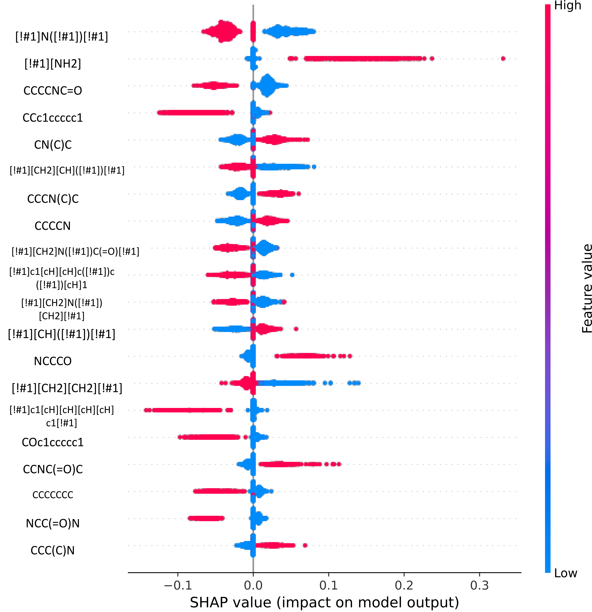

# How can SHAP values help to shape metabolic stability of chemical compounds?

This repository accompanies article *How can SHAP values help to shape metabolic stability of chemical compounds?* by Agnieszka Pocha, Rafał Jankowski, and Sabina Podlewska.

## Summary

We build several classification and regression models to predict metabolic stability, which determines the time that the compound can act in an organism and play its role as a drug.

We propose to analyse these models with SHapley Additive exPlanations (SHAP) on the assumption that if a model is capable of predicting metabolic stability well, then the features it uses might be relevant in determination of underlying factors that influence this property.

You can use an accompanying [web service](https://metstab-shap.matinf.uj.edu.pl/) to obtain predictions and SHAP analyses for your compounds using several of our models.

SHAP values of correctly predicted compounds from ChEMBL dataset for human metabolic stability. The figure was generated for SVM model trained using Klekota-Roth fingerprints.

Each row corresponds to one of the 20 most important features. Each dot in a row represents a single compound, its colour the value of the corresponding feature (blue – absence, red – presence), and the position on the x-axis is the SHAP value itself.

High positive or negative SHAP values suggest that a feature is important, with positive values indicating that the feature increases the model’s output and negative values indicating the decrease in the model’s output. The values close to zero indicate features of low importance.

One can observe a strong correlation between a presence of certain chemical substructures and its influence on the model's output. For example, the presence of [!#1]N([!#1])[!#1] is for many compounds an indicator of their decreased stability, while its absence pushes the model's prediction towards higher stability.

## How to use this code

- `configs` - configuration files
- `data` - data split for both human and rat data
- `env` - files required to build the environment
- `metstab_shap` - the source code
- `models` - scripts to train the best performing models

You can use
`python metstab_shap/run.py {model config} {data config} {representation config} {task config} {tpot config} {ml results directory}` to run a hyperparameter optimisation and save the best performing model in `{ml results directory}`.

This model can be analysed with:
`python metstab_shap/calculate_shap_values.py {ml results directory} {shap results directory} {shap config}`, which will calculate the SHAP values for all compounds in the dataset.

Both `run.py` and `calculate_shap_values.py` need to be updated to point to your [Neptune](https://neptune.ai/) projects. Alternatively, you can comment out any lines that refer to Neptune.

### An example with your own environment

You can use `environment.yml` to build a conda environment: `conda env create -f env/environment.yml`, and activate it with: `source activate stab`.

Export your Neptune token with: `export NEPTUNE_API_TOKEN="your Neptune token"`.

Assuming your current working directory is the main directory of this repository, you can train a model using: `python metstab_shap/run.py configs/model/nb.cfg configs/data/human.cfg configs/repr/maccs.cfg configs/task/classification.cfg configs/tpot-mini.cfg ml-results/h-ma-c-nb`. And analyse it using: `python metstab_shap/calculate_shap_values.py ml-results/h-ma-c-nb shap-results/h-ma-c-nb configs/shap.cfg`.

### An example with a Singularity container

First, you need to update the provided Singularity recipe with your Neptune token and set the `PYTHONPATH` to point to the main directory of this repository. Now, you can build a Singularity container with: `sudo singularity build metpred.simg env/metpred.def`. 

Assuming you downloaded this repository to your `$HOME` directory, you can train a model using:
`singularity run --pwd $HOME/metstab-shap -B $HOME:$HOME metpred.simg python metstab_shap/run.py configs/model/nb.cfg configs/data/human.cfg configs/repr/maccs.cfg configs/task/classification.cfg configs/tpot-mini.cfg ml-results/h-ma-c-nb`.

And analyse it using:
`singularity run --pwd $HOME/metstab-shap -B $HOME:$HOME metpred.simg python metstab_shap/calculate_shap_values.py ml-results/h-ma-c-nb shap-results/h-ma-c-nb configs/shap.cfg`.
